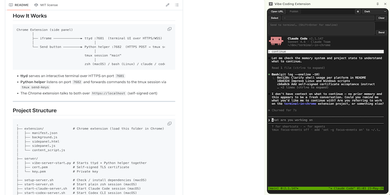

# Vibe Coding Extension

A Chrome extension that embeds a live terminal in Chrome's side panel, powered by [ttyd](https://github.com/tsl0922/ttyd) and [tmux](https://github.com/tmux/tmux). You can send commands directly from the browser, select page elements to use as context, and connect to an AI coding agent (Claude Code or Codex CLI) instead of a plain shell.



---

## How It Works

```
Chrome Extension (side panel)
        │
        ├── iframe ──────────────► ttyd :7681  (terminal UI over HTTPS/WSS)
        │                               │
        └── Send button ─────────► Python helper :7682  (HTTPS POST → tmux send-keys)
                                        │
                                   tmux session "main"
                                        │
                                   zsh (macOS) / bash (Linux) / claude / codex
```

- **ttyd** serves an interactive terminal over HTTPS on port `7681`
- **Python helper** listens on port `7682` and forwards commands to the tmux session via `tmux send-keys`
- The Chrome extension talks to both over `https://localhost` (self-signed cert)

---

## Project Structure

```
.
├── extension/               # Chrome extension (load this folder in Chrome)
│   ├── manifest.json
│   ├── background.js
│   ├── sidepanel.html
│   ├── sidepanel.js
│   └── content_script.js
│
├── server/
│   ├── vibe-server-start.py # Starts ttyd + Python helper together
│   ├── cert.pem             # Self-signed TLS certificate
│   └── key.pem              # Private key
│
├── setup-server.sh          # Check / install dependencies (macOS)
├── start-server.sh          # Start plain zsh session (macOS)
├── start-claude-server.sh   # Start Claude Code session (macOS)
├── start-codex-server.sh    # Start Codex CLI session (macOS)
├── clear-server-session.sh  # Kill the tmux session (macOS)
│
├── setup-server-linux.sh    # Linux equivalents
├── start-server-linux.sh
├── start-claude-server-linux.sh
├── start-codex-server-linux.sh
├── clear-server-session-linux.sh
│
├── setup-server-windows.bat # Windows (WSL2) equivalents
├── start-server-windows.bat
├── start-claude-server-windows.bat
├── start-codex-server-windows.bat
└── clear-server-session-windows.bat
```

---

## Prerequisites

- **macOS / Linux**: `python3`, `ttyd`, `tmux`
- **Windows**: WSL2 with a Linux distro (Ubuntu recommended), then the same three tools inside WSL2
- For AI sessions: [Claude Code](https://docs.anthropic.com/en/docs/claude-code) and/or [Codex CLI](https://github.com/openai/codex) installed and authenticated

> **Note:** This project does not handle the installation or configuration of Claude Code or Codex CLI. The AI session scripts assume the `claude` / `codex` command is already installed, authenticated, and working in your terminal before you start.

Run the setup script to check and optionally install missing dependencies:

```bash
# macOS
./setup-server.sh

# Linux
./setup-server-linux.sh

# Windows (run in CMD or PowerShell)
setup-server-windows.bat
```

---

## TLS Certificate

ttyd requires HTTPS. The `server/` folder should contain a self-signed `cert.pem` and `key.pem`. To generate them:

```bash
openssl req -x509 -newkey rsa:2048 -keyout server/key.pem -out server/cert.pem \
  -days 365 -nodes -subj "/CN=localhost"
```

After starting the server, you must visit both URLs directly in Chrome **once** and accept the self-signed certificate warning for each:

1. Open `https://localhost:7681` in a Chrome tab
2. Click **Advanced** → **Proceed to localhost (unsafe)**
3. Open `https://localhost:7682` in a Chrome tab and repeat

Chrome will remember the exception for both ports. Without this step, the extension's iframe and the Send button will silently fail to connect.

---

## Starting the Server

Choose the session type you want:

Scripts use **zsh** on macOS and **bash** on Linux and Windows (WSL2).

| Session | macOS (zsh) | Linux (bash) | Windows — WSL2 (bash) |
|---|---|---|---|
| Plain shell | `./start-server.sh` | `./start-server-linux.sh` | `start-server-windows.bat` |
| Claude Code | `./start-claude-server.sh` | `./start-claude-server-linux.sh` | `start-claude-server-windows.bat` |
| Codex CLI | `./start-codex-server.sh` | `./start-codex-server-linux.sh` | `start-codex-server-windows.bat` |

All scripts must be run from the **project root**. Press `q + Enter` to stop the server cleanly.

---

## Installing the Extension

1. Open `chrome://extensions` in Chrome
2. Enable **Developer mode** (top right)
3. Click **Load unpacked** and select the `extension/` folder
4. Click the extension icon in the toolbar to open the side panel

---

## Extension Features

- **Terminal** — full interactive terminal embedded in the side panel via ttyd
- **Send** — type a command in the send box and press Enter (or click Send) to run it in the terminal without clicking into the iframe. Shift+Enter for multi-line input
- **Element selector** — click **Select**, then click any element on the active tab to capture its HTML. Click multiple elements to accumulate context. Click **Clear** to reset
- **Context-aware send** — when elements are selected, the send message is automatically prefixed with the current page URL and the selected HTML before being sent to the terminal
- **Open URL** — open any URL in a new tab
- **Themes** — Dark, Light, Solarized Dark, Dracula, One Dark
- **Config** — click the gear icon to change the host (default: `localhost`) if running the server on a different machine

---

## Stopping and Cleaning Up

Stop the server by pressing `q + Enter` in the terminal where it is running.

To also destroy the tmux session (e.g. to start fresh):

```bash
# macOS
./clear-server-session.sh

# Linux
./clear-server-session-linux.sh

# Windows
clear-server-session-windows.bat
```

Note: `clear-server-session` will refuse to run while `vibe-server-start.py` is still running.

On Windows, if you closed the CMD window without pressing `q + Enter`, use `stop-server-windows.bat` to force-kill the server processes before running `clear-server-session-windows.bat`.

---

## Windows (WSL2) Notes

**WSL2 is not installed automatically by these scripts.** Before running any `.bat` script on a new machine, install WSL2 manually first:

1. Open **PowerShell as Administrator** and run:
   ```
   wsl --install
   ```
2. **Restart Windows** when prompted
3. Open the **Ubuntu** app once, create a Linux username and password when prompted, then close it — it does not need to stay running
4. Then run `setup-server-windows.bat` to check and install the remaining dependencies

The `.bat` scripts are thin wrappers that call the corresponding `-linux.sh` scripts inside your WSL2 distro. WSL2 automatically forwards `localhost` ports to Windows, so the Chrome extension connects to `https://localhost:7681` and `https://localhost:7682` without any extra network configuration. Claude Code and Codex CLI must be installed **inside WSL2**, not on Windows.

> **Windows 10 minimum:** Version 2004 (Build 19041, May 2020 update) or later. Windows 11 is fully supported.
